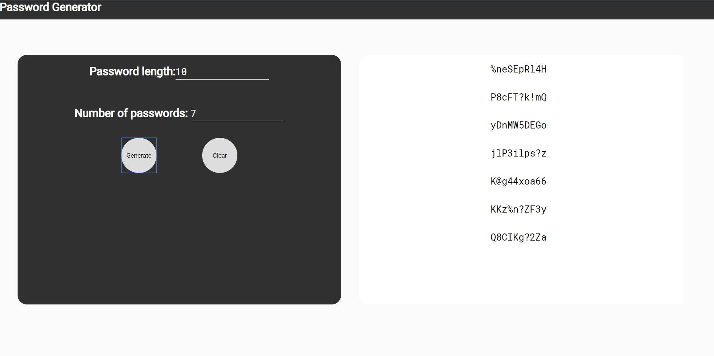

# Password Generator

*This project was bootstrapped with [Create React App](https://github.com/facebook/create-react-app).*

Sometimes, thinking of a strong password can be a bit tedious, so I wrote some javascript code to randomly generate a string of characters when given a specified length. The code is in *`src/PasswordGenerator.js`*. That code provides the core functionality of this app.<br>
Domain: https://password-generator-2019.herokuapp.com/
# Components
## App.js
 The top level component that renders the Body and Navbar. 
## Body
*path: src/Components/Body*<br>
This is class based component that handles most of the logic. The passwords are stored in the component's state as an array and passed to the PasswordDisplay component through props.
The component has input fields to allow the user to specify the length of the passwords and the number of passwords to generate. It also has two buttons, one to trigger the `generate()` function and one to trigger the `clear()` function.

  ### State:
  * length
  * passwords
  * count

  ### Functions:
  * `generate()`: The passwords are generated through the `generate()` function, which in turn creates and instance of the `PasswordGenerator` class that then generates passwords. It accepts "count" and "length" stored in the components state as arguments. <br>
  * `clear()`: Resets the component's state back to the default. 


## PasswordDisplay
*path: src/Components/PasswordDisplay*<br>
This is a functional component. It receives the passwords through props and maps over the array of passwords, rendering a paragraph tag for each one. 

## NavBar
Basic functional app that displays the name of the app. 

# Screen Shots
## Default Page


## Generated Passwords


## Available Scripts
* **Run**: ```npm start```<br>
Open [http://localhost:3000](http://localhost:3000) to view it in the browser.
* **Test**:`npm test`<br>
Launches the test runner in the interactive watch mode.<br>
* **Build**: `npm run build`<br>
Builds the app for production to the `build` folder.<br>


## Learn More

You can learn more in the [Create React App documentation](https://facebook.github.io/create-react-app/docs/getting-started).

To learn React, check out the [React documentation](https://reactjs.org/).

